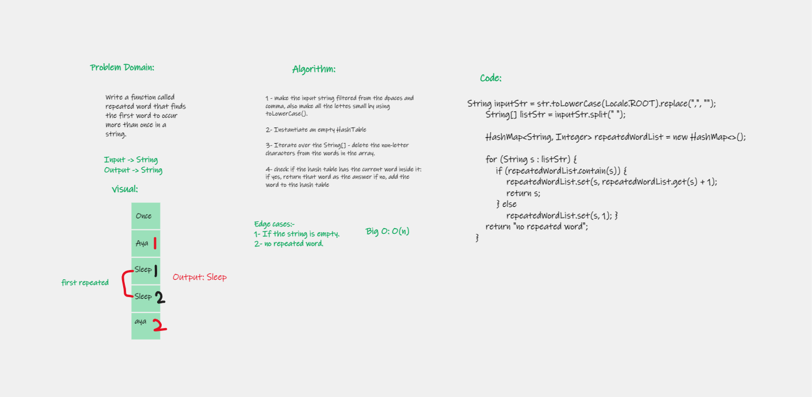
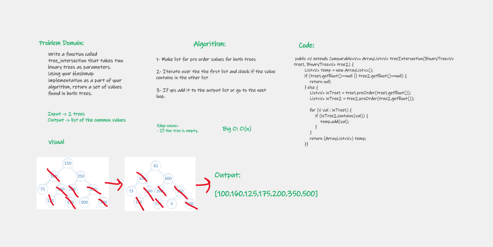

# Hashtables
<!-- Short summary or background information -->
#### The Hashtable class implements a hash table, which maps keys to values. Any non-null object can be used as a key or as a value. To successfully store and retrieve objects from a hashtable, the objects used as keys must implement the hashCode method and the equals method.

## Challenge
<!-- Description of the challenge -->
#### Implement a Hashtable Class with the following methods:

+ set: This method should hash the key, and set the key and value pair in the table, handling collisions as needed.
+ get: Returns a Value associated with that key in the table.
+ contains: indicating if the key exists in the table already.
+ keys: Returns a Collection of keys.
+ hash: Returns a Index in the collection for that key.

## Approach & Efficiency
<!-- What approach did you take? Why? What is the Big O space/time for this approach? -->

|       | hash(K key) | set(K key, V value) | get(K key) | contains(K key) |
|-------|-------------|---------------------|------------|-----------------|
| Time  | O(1)        | O(n)                | O(1)       | O(1)            |
| Space | O(1)        | O(n)                | O(1)       | O(1)            |

# repeated word
### Challenge Summary
##### Write a function called repeated word that finds the first word to occur more than once in a string.

|       | repeated word (String) |
|-------|------------------------|
| Time  | O(n)                   |  
| Space | O(n)                   |

# Find common values in 2 binary trees.

### Challenge Summary
##### Write a function called tree_intersection that takes two binary trees as parameters.Using your Hashmap implementation as a part of your algorithm, return a set of values found in both trees.

|       | common values  |
|-------|----------------|
| Time  | O(n)           |  
| Space | O(n)           |

