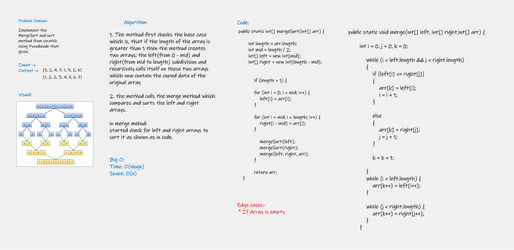

# Insertion Sort Algorithm

# Challenge Summary
<!-- Description of the challenge -->
#### **Implement the insertion sort method from scratch using Pseudocode that given.**

## Whiteboard Process
<!-- Embedded whiteboard image -->

## Approach & Efficiency
<!-- What approach did you take? Why? What is the Big O space/time for this approach? -->

Time       |   Space      
---------- |----------
O(nlogn)   |     O(n)

## Solution
<!-- Show how to run your code, and examples of it in action -->
#### Go to The App.main and run it to show the results, Or you can go to the AppTest.java and run too.
