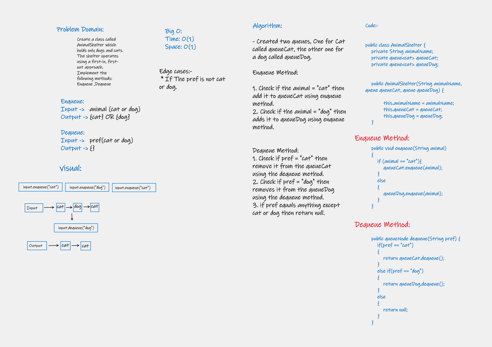

# Challenge Summary
<!-- Description of the challenge -->
### Create a class called AnimalShelter which holds only dogs and cats.
### The shelter operates using a first-in, first-out approach.
### Implement the following methods: Enqueue ,Dequeue

## Whiteboard Process
<!-- Embedded whiteboard image -->

## Approach & Efficiency
<!-- What approach did you take? Why? What is the Big O space/time for this approach? -->
### Big O:
### Time: O(1)
### Space: O(1)

## Solution
<!-- Show how to run your code, and examples of it in action -->
### 1) Way 1: you have to go to App.java(App.main) to check my code then run it to show the result.
### 2) Way 2: you have to go to AppTest.java and run the function called (Animal Shelter Test1 : for Enqueue Method) and function called(Animal Shelter Test2 for Dequeue Method)then run it to show the result.

