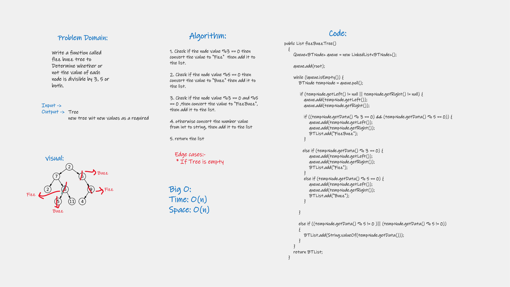

# Challenge Summary
<!-- Description of the challenge -->
### Write a function called fizz buzz tree to Determine whether or not the value of each node is divisible by 3, 5 or both.

## Whiteboard Process
<!-- Embedded whiteboard image -->

## Approach & Efficiency
<!-- What approach did you take? Why? What is the Big O space/time for this approach? -->
#### Big O:
+ Time: O(n)
+ Space: O(n)

## Solution
<!-- Show how to run your code, and examples of it in action -->

