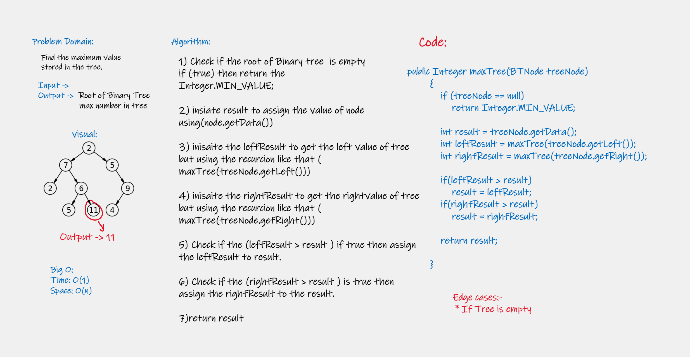

# Challenge Summary
<!-- Description of the challenge -->
### Find the maximum value stored in the tree.

## Whiteboard Process
<!-- Embedded whiteboard image -->

## Approach & Efficiency
<!-- What approach did you take? Why? What is the Big O space/time for this approach? -->

### Big O:
+ Time: O(1)
+ Space: O(n)

## Solution
<!-- Show how to run your code, and examples of it in action -->
### Go to The App.main and run it to show the results (Get the max value for Binary Trees) Or you can go to the AppTest.java (The last method) and run it to get the result.