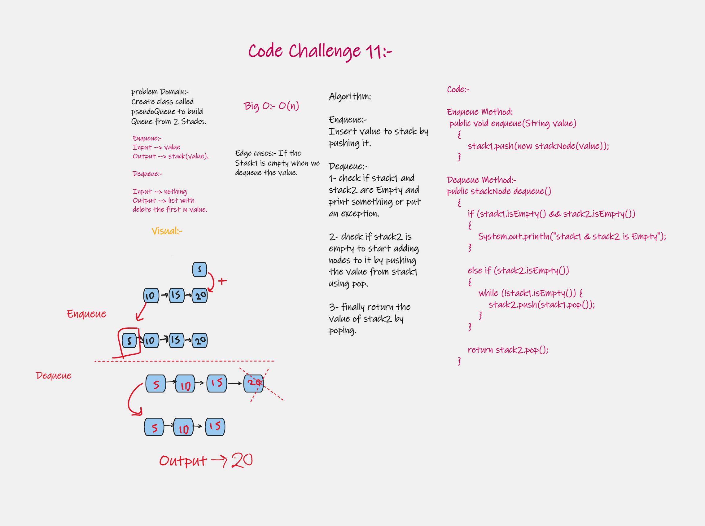

# Challenge Summary
<!-- Description of the challenge -->
#### Create class called pseudoQueue to build Queue from 2 Stacks.

## Whiteboard Process
<!-- Embedded whiteboard image -->



## Approach & Efficiency
<!-- What approach did you take? Why? What is the Big O space/time for this approach? -->
#### Big(o) -> O(n)

## Solution
<!-- Show how to run your code, and examples of it in action -->
### **code**

#### Enqueue Method :-
```mermaid

public void enqueue(String value)
    {
        stack1.push(new stackNode(value));
    }

```
#### Dequeue Method :-
```mermaid
public stackNode dequeue()
{
if (stack1.isEmpty() && stack2.isEmpty())
{
System.out.println("stack1 & stack2 is Empty");
}

        else if (stack2.isEmpty())
        {
            while (!stack1.isEmpty()) {
                stack2.push(stack1.pop());
            }
        }

        return stack2.pop();
    }

```

#### There is an example in the main section, you can see it there