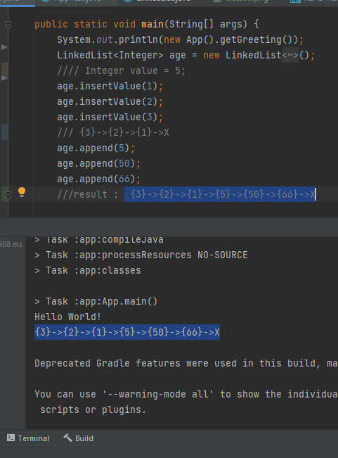

# Challenge Summary
<!-- Description of the challenge -->
### Write the following methods for the Linked List class:

### **1) append Method**
#### arguments: new value
#### adds a new node with the given value to the end of the list
### **2) insert before Method**
#### arguments: value, new value
#### adds a new node with the given new value immediately before the first node that has the value specified
### **3) insert after**
#### arguments: value, new value
#### adds a new node with the given new value immediately after the first node that has the value specified

<br>

## Whiteboard Process
<!-- Embedded whiteboard image -->

<br>


## Approach & Efficiency
<!-- What approach did you take? Why? What is the Big O space/time for this approach? -->
#### insertValue : Big(O) --> O(1)
#### append : Big(O) --> O(logn)
#### insertAfter : Big(O) --> O(logn)
#### insertBefore : Big(O) --> O(logn)
### totally : Big(O) --> O(logn)

#### Note: it took 8 hours.


## Solution
<!-- Show how to run your code, and examples of it in action -->

```
public void append(T value)
    {
        Node newValue = new Node(value);
        if(headValue == null) {
            headValue = newValue;
        }
        else
        {
            Node tail = headValue;
            while(tail.nextValue != null){
                tail = tail.nextValue;
            }
            tail.nextValue = newValue;
        }
    }
```

```
public void insertAfter(T value, T newValue) {
        Node pointer = this.headValue;
        while (pointer != null) {
            if (pointer.value == value) {
                Node newNode = new Node(newValue);
                newNode.nextValue = pointer.nextValue;
                pointer.nextValue = newNode;
                break;
            }
            pointer = pointer.nextValue;

        }
    }
```

```
public void insertBefore(T value, T newValue)
        {
            Node pointer = this.headValue;
            while (pointer != null) {
                if (pointer.nextValue.value == value) {
                    Node newNode = new Node(newValue);
                    newNode.nextValue = pointer.nextValue;
                    pointer.nextValue = newNode;
                    break;
                }
                pointer = pointer.nextValue;

                }
        }
```


