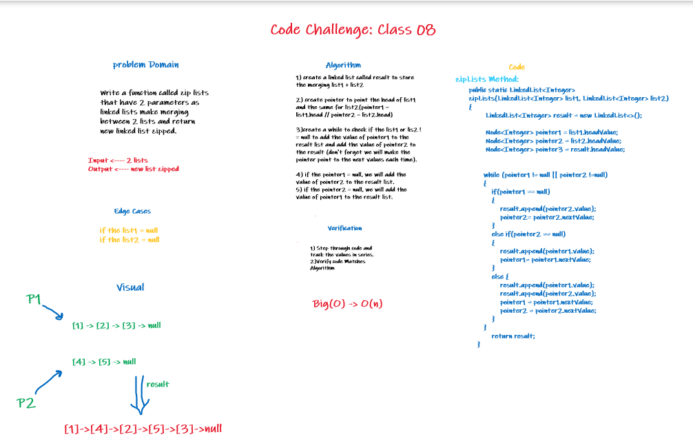
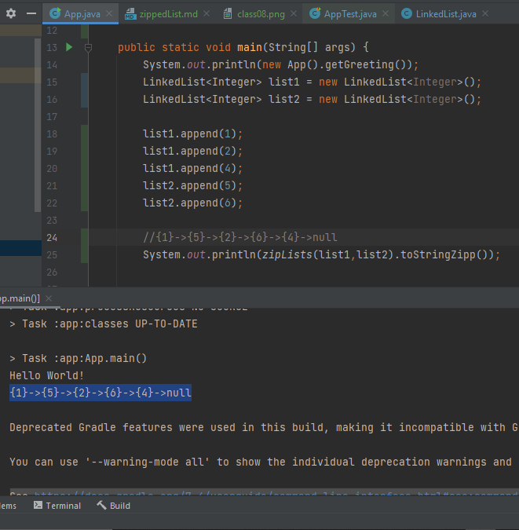
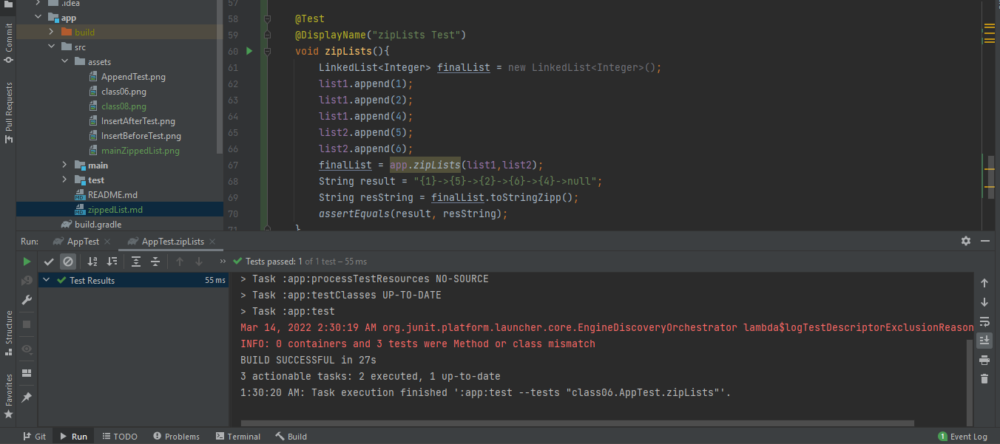

# Challenge Summary - Class08
<!-- Description of the challenge -->
### Write a function called zip lists that have 2 parameters as linked lists make merging between 2 lists and return new linked list zipped.


## Whiteboard Process
<!-- Embedded whiteboard image -->


## Approach & Efficiency
<!-- What approach did you take? Why? What is the Big O space/time for this approach? -->
## Big(O) -> O(n).
## Solution
<!-- Show how to run your code, and examples of it in action -->
```mermaid
public static LinkedList<Integer> zipLists(LinkedList<Integer> list1, LinkedList<Integer> list2) {
        LinkedList<Integer> result = new LinkedList<>();

        Node<Integer> pointer1 = list1.headValue;
        Node<Integer> pointer2 = list2.headValue;
        Node<Integer> pointer3 = result.headValue;


       while (pointer1 != null || pointer2 !=null)
       {
           if(pointer1 == null)
           {
               result.append(pointer2.value);
               pointer2= pointer2.nextValue;
           }
           else if(pointer2 == null)
           {
               result.append(pointer1.value);
               pointer1= pointer1.nextValue;
           }
           else {
               result.append(pointer1.value);
               result.append(pointer2.value);
               pointer1 = pointer1.nextValue;
               pointer2 = pointer2.nextValue;
           }
       }
           return result;
    }

```

## App.java Run(main):



## AppTest.java Run (test section):
### Test Passed
