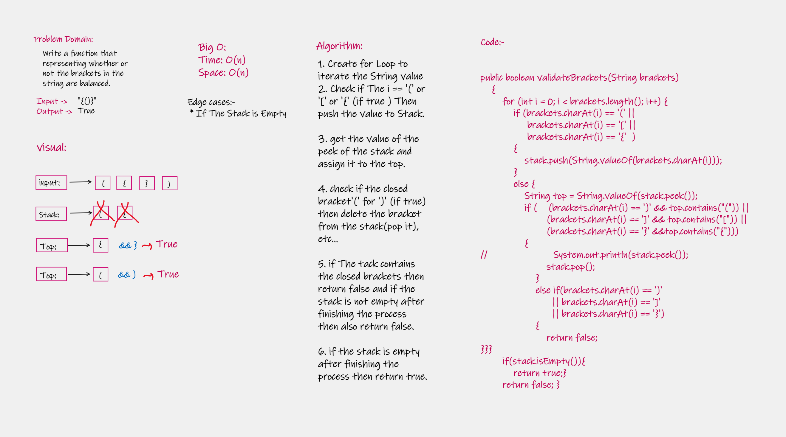

# Challenge Summary
<!-- Description of the challenge -->
### Write a function that representing whether or not the brackets in the string are balanced.

## Whiteboard Process
<!-- Embedded whiteboard image -->

## Approach & Efficiency
<!-- What approach did you take? Why? What is the Big O space/time for this approach? -->
### Big O:
### Time: O(n)
### Space: O(n)

## Solution
<!-- Show how to run your code, and examples of it in action -->
### 1) Way 1: you have to go to App.java(App.main) to check my code then run it to show the result.
### 2) Way 2: you have to go to AppTest.java and run the function called (validBrackets) then run it to show the result.