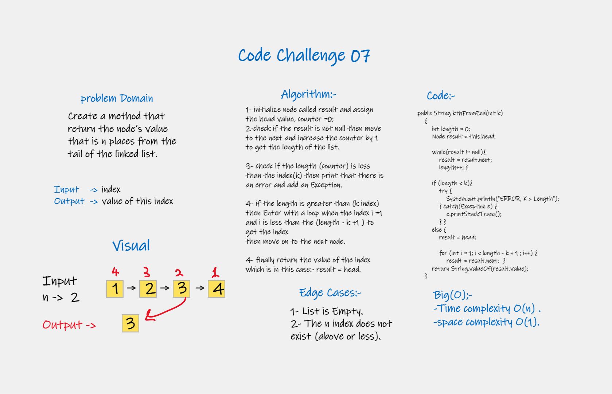

# Challenge Summary
<!-- Description of the challenge -->
#### Create a method that return the node’s value that is k places from the tail of the linked list.

## Whiteboard Process
<!-- Embedded whiteboard image -->

## Approach & Efficiency
<!-- What approach did you take? Why? What is the Big O space/time for this approach? -->
#### Big(O);-
#### -Time complexity O(n) .
#### -space complexity O(1).

## Solution:
##### go to the App.main inside App.java or AppTest.java to test my code.