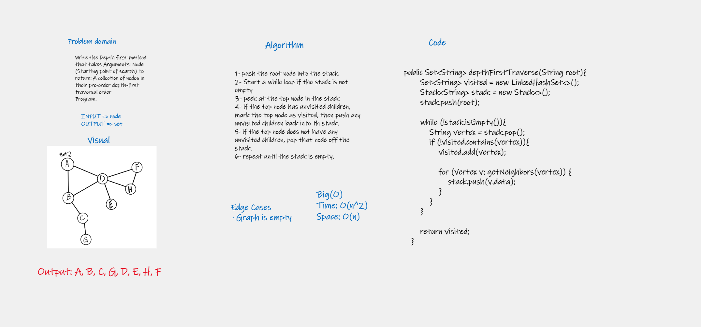

# Challenge Summary
Write the Depth first method that takes Arguments: Node (Starting point of search) to return: A collection of nodes in their pre-order depth-first traversal order
Program.

## Whiteboard Process

## Approach & Efficiency
- Time: O(n^2) worst case where n is the number of nodes in the graph of a Complete Graph
- Space: O(n) n is the number of nodes

