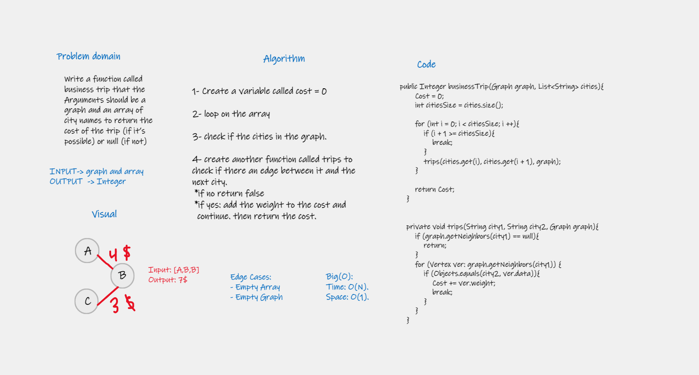

# Challenge Summary
Given a business trip itinerary, and an Alaska Airlines route map, is the trip possible with direct flights? If so, how much will the total trip cost be?

## Whiteboard Process
<!-- Embedded whiteboard image -->

## Approach & Efficiency
1. add node
- Time: O(n * m): where n is the cities in the itinerary and m is the available paths in that city
- Space: O(1)
