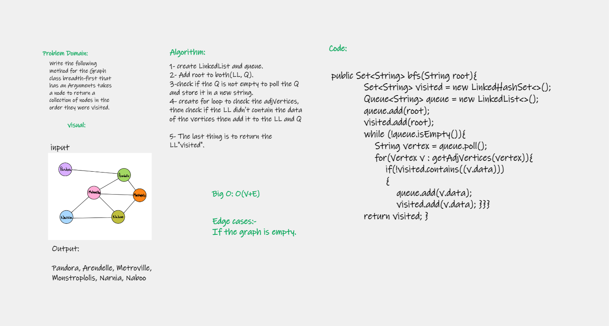
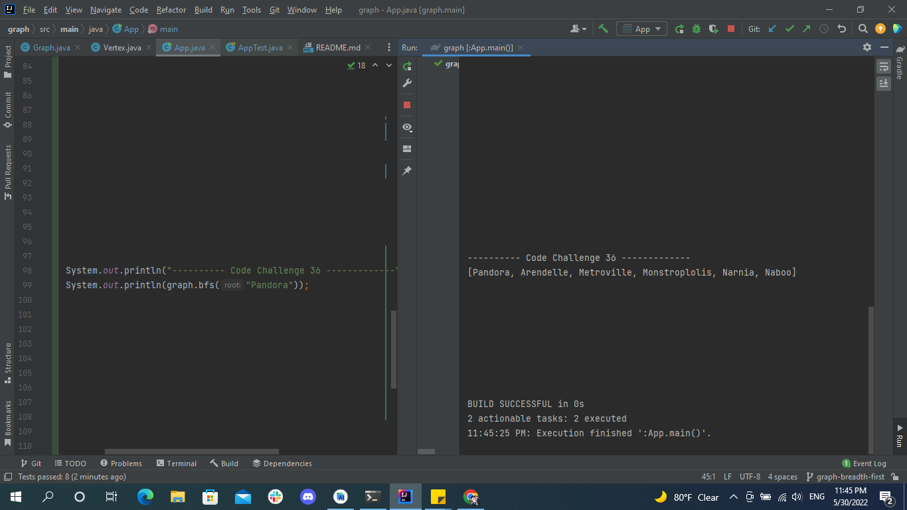

# Challenge Summary
<!-- Description of the challenge -->
### Write the following method for the Graph class breadth-first that has an Arguments takes a node to return a collection of nodes in the order they were visited.

## Whiteboard Process
<!-- Embedded whiteboard image -->

## Approach & Efficiency
<!-- What approach did you take? Why? What is the Big O space/time for this approach? -->
## bfs -> O(V+E)

## Solution
<!-- Show how to run your code, and examples of it in action -->
