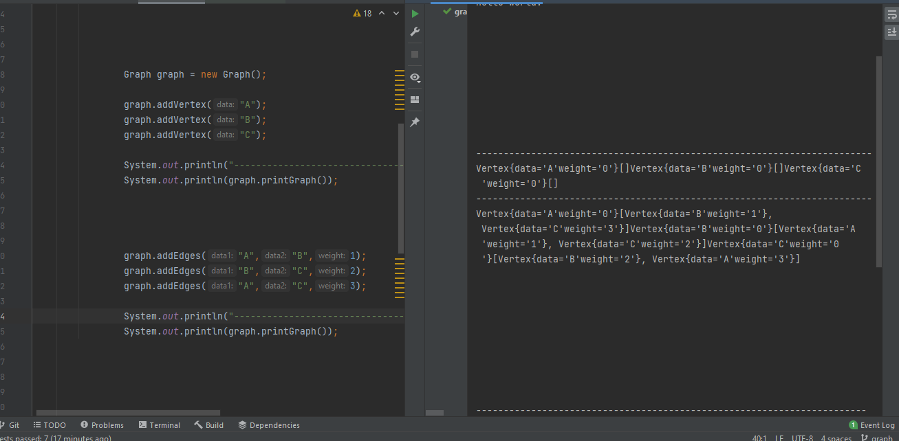
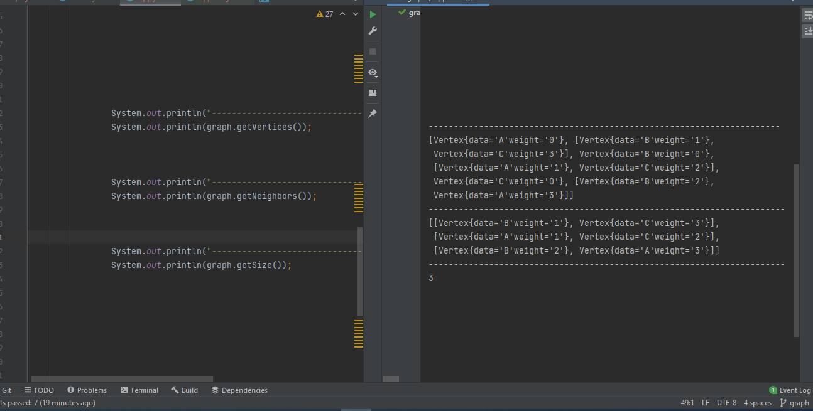

# Graphs
<!-- Short summary or background information -->
Implement your own Graph. The graph should be represented as an adjacency list, and should include the following methods:

+ 1) add node
+ 2) add edge
+ 3) get nodes
+ 4) get neighbors
+ 5) get size

## Challenge
<!-- Description of the challenge -->
Implement your own Graph. The graph should be represented as an adjacency list, and should include the following methods:

+ add node: Add a node to the graph
+ add edge: Adds a new edge between two nodes in the graph If specified, assign a weight to the edge Both nodes should already be in the Graph
+ get nodes: Returns all of the nodes in the graph as a collection (set, list, or similar)
+ get neighbors: Returns a collection of edges connected to the given node Include the weight of the connection in the returned collection
+ size: Returns the total number of nodes in the graph

## Approach & Efficiency
<!-- What approach did you take? Why? What is the Big O space/time for this approach? -->
+ add node -> O(1)
+ add edge -> O(1)
+ get nodes -> O(n)
+ get neighbors -> O(1)
+ get size -> O (1)
## API
<!-- Description of each method publicly available in your Graph -->

 

